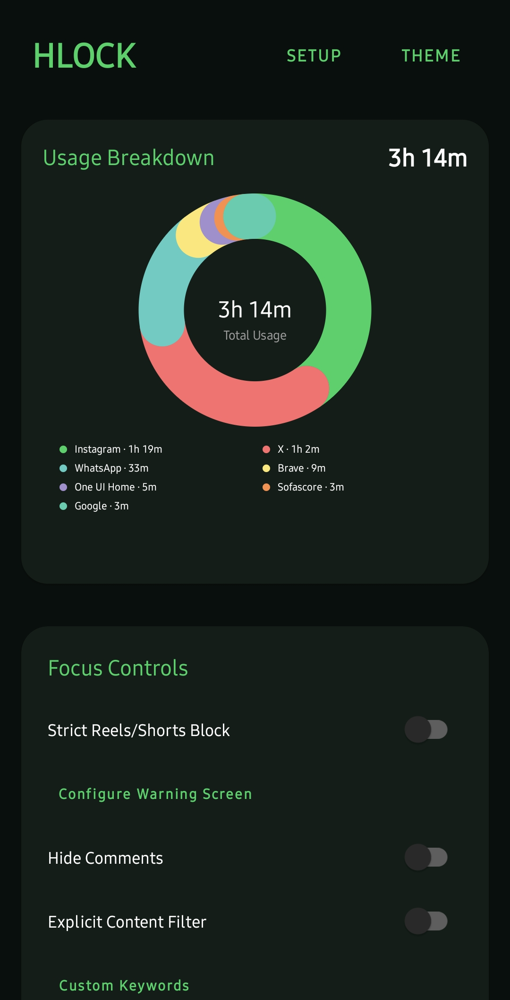
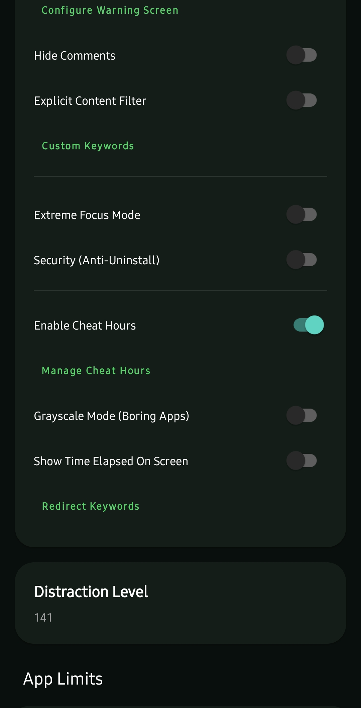
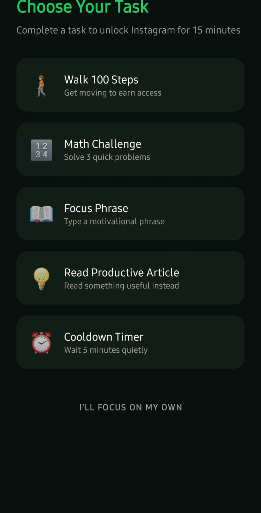
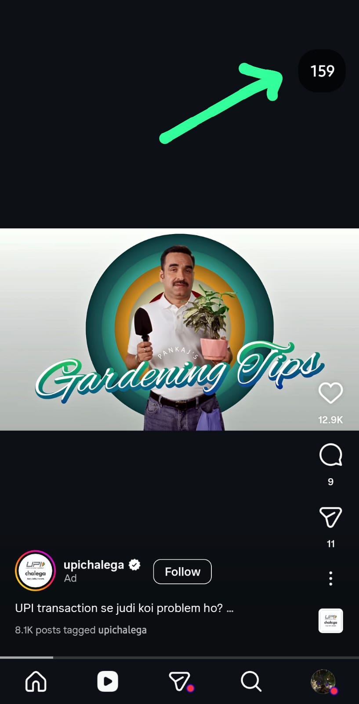
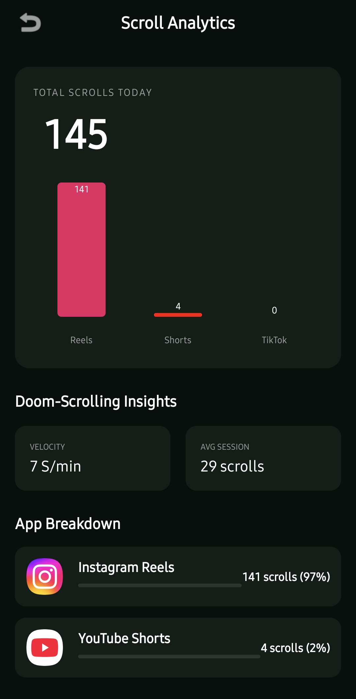
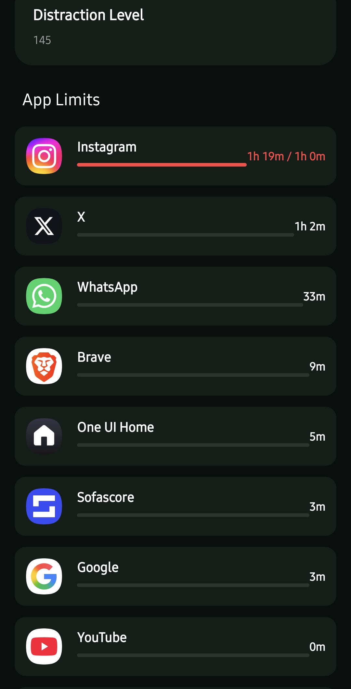

#  HabitLock – Smart Digital Wellbeing & Focus Enforcement

[](https://developer.android.com)
[](https://kotlinlang.org)
[](https://github.com/your-username/HabitLock/pulls)

**HabitLock** is a next-generation Android application designed to eliminate digital distractions and enforce disciplined usage habits. Unlike traditional screen-time apps, HabitLock uses **behavioral enforcement + real-world friction**, ensuring users must earn access to distracting apps through meaningful effort.

---

## 📦 Download APK

You can download the latest version of HabitLock from the **[GitHub Releases](https://github.com/PrashantDhuri08/HabitLock/releases)** page (~8MB).

---

## 🔐 Privacy First

- **100% On-Device Processing**: All monitoring and analysis happen locally.
- **No Data Sharing**: Your usage data never leaves your device.
- **No Cloud Dependency**: Works perfectly offline without tracking.

---

## 📸 Screenshots

<p align="center">
  
  
  
</p>
<p align="center">
  
  
  
  
</p>

---

## 🚀 Core Features

### 🧠 Behavior-Aware Monitoring

- **Real-time app usage tracking**: Stay informed about where your time goes.
- **Scroll Analytics**: Specifically tracks Instagram, TikTok, and YouTube Shorts.
- **Reels Count Overlay**: Displays a real-time counter of reels/shorts consumed while scrolling.

### 📊 Analytics & Insights

- **Detailed Usage Stats**: Track daily app usage with precision.
- **Content Counters**: Count exactly how many TikToks/Reels you've consumed.
- **Pattern Identification**: Identify addictive usage patterns.

### 🚫 Smart Blocking System

- **App Blocking**: Hard system-level blocking using accessibility overlays.
- **Focus Mode**: Completely block selected apps during study or work sessions.
- **Cheat Hours**: Scheduled relaxation windows to prevent burnout.

### 🎯 Content Control Features

- **Explicit Content Filter**: Keyword-based detection and URL pattern scanning.
- **Keyword Blocking**: Real-time custom keyword blocking across all apps.
- **Smart Redirection**: Redirects from distractions to productive articles or learning resources.
- **Shorts/Reels Blocking**: Detects and interrupts infinite scrolling feeds.
- **Comment Blocking**: Hides distracting comment sections.

### 🧩 Advanced Control Features

- **🎨 Grayscale Mode**: Anti-dopamine UI that turns selected apps black & white.
- **⏱️ Real-Time Usage Overlay**: Displays time spent directly on the screen.
- **🛡️ Anti-Uninstall Protection**: Prevents impulsive removal of the app.
- **⚠️ Custom Warning Screen**: Fully customizable messages and motivation.
- **🌍 Geo-Blocking**: Location-based app restrictions (e.g., Library, Workplace).

### 🏃 Task-Based Unlock System

To unlock blocked apps, users must prove their commitment by completing tasks:

- 🚶 **Step Challenge**: Sensor-verified walking.
- 🧮 **Math Problems**: Solve equations to engage your brain.
- 📖 **Reading Task**: Read articles before you consume.
- ⏳ **Wait Timers**: Practice patience.
- ✍️ **Typing Challenge**: Type complex sentences to overcome laziness.

### 🧱 UI & Widgets

- **Home screen widgets**: Quick access to your progress.
- **Usage summaries**: Clear visualization of your digital habits.
- **Quick toggles**: Easily enable/disable focus mode when needed.

---

## 💡 Key Innovation: "Productive Friction"

HabitLock introduces the concept of **"Productive Friction"** — forcing real-world or cognitive effort before allowing digital consumption. This short-circuits the dopamine loop of impulsive app usage by introducing a deliberate pause that requires active participation.

---

## 🏗️ Tech Stack

- **Language**: [Kotlin](https://kotlinlang.org/)
- **Platform**: Android (Min SDK: 24 / Android 7.0)
- **Core APIs**:
  - `AccessibilityService` (for blocking and behavior detection)
  - `UsageStatsManager` (for tracking)
  - `SensorManager` (for task verification)
  - `Location Services` (for Geo-blocking)
  - `System Alert Window` (for overlays)

---

## ⚙️ Requirements

- Android 7.0 (Nougat) or above.
- Physical device recommended (for sensors and overlay stability).
- Accessibility and Overlay permissions enabled.

---

## 🛠️ Build Instructions

1. **Clone the repository:**
   ```bash
   git clone https://github.com/your-username/HabitLock.git
   ```
2. **Navigate to the project directory:**
   ```bash
   cd HabitLock
   ```
3. **Build the project:**
   ```bash
   ./gradlew build
   ```
4. **Install on device:**
   ```bash
   ./gradlew installDebug
   ```

---

## 🧠 How It Works

1. **Monitor**: The app monitors usage and behavior in real-time.
2. **Detect**: It identifies triggers like infinite scrolling or blocked keywords.
3. **Trigger**: A blocking overlay is immediately deployed.
4. **Enforce**: Users are presented with a task (math, steps, etc.).
5. **Verify**: Access is only restored once the task is successfully completed.

---

## 🔥 Why HabitLock?

| Feature                  | Traditional Apps | HabitLock |
| :----------------------- | :--------------: | :-------: |
| Passive Tracking         |        ✅        |    ✅     |
| Hard Blocking            |        ❌        |    ✅     |
| Physical Task Unlock     |        ❌        |    ✅     |
| Scroll Behavior Analysis |        ❌        |    ✅     |
| Keyword Redirection      |        ❌        |    ✅     |
| Anti-Uninstall           |        ❌        |    ✅     |
| Geo-Based Control        |        ❌        |    ✅     |

---

## 🔮 Future Scope

- 🤖 AI-based addiction prediction
- 😊 Emotion-aware blocking
- ⌚ Smartwatch integration
- 🤝 Social accountability system
- 🎮 Gamification (XP, streaks, leaderboard)

---

## 👨‍💻 Contributors

- **Prashant Dhuri**
- **Ritesh Gharat**
- **Prem Chaurasiya**
- **Sarthak Darge**

---

## ⭐ Support

If you find this project helpful, please give it a ⭐ on GitHub! It helps more people discover the tool.

---

<p align="center">Made with ❤️ for a better digital life</p>
